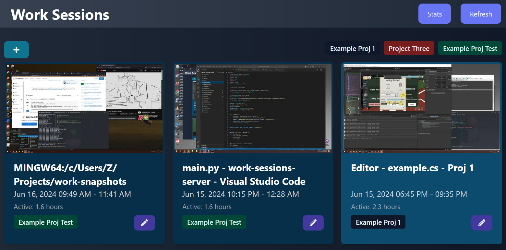

Work Snapshots
==============

Take screenshots only when specific applications are running and group
screenshots into work sessions.

Add tags to sessions to track time spent on projects or to look through progress.


### Features
- Take screenshots evey few mins if any "interesting" application is running
  - A camera sound is played everytime a screenshot is taken
  - You can configure which applications count as "interesting"
- Add tags for different project to track time spent on them
- Manually disable recording even when "interesting" applications are running


### Screenshots

The home page of the dashboard shows a set of "work sessions" which is a series
of snapshots grouped together. So you know how long you worked on a specific thing
at a time.


Each session can be tagged with a project.

You can also see your activity in aggregate in the "Stats" page. This
shows you a "heatmap" of how active you were on each day. It also
gives you a table to show you how much time you have spent on different projects.


By default, snapshots are taken when you are working on any applications
that match a hardcoded list. You can disable recording even
when those applications are open by clicking "Force Ignore Activity"


### Problems
- Set up is manual (need to create two python virtual environments and a node environment)
- Windows setup is easier - mac setup is more convoluted
- Screenshots and process data is stored in plaintext! You have to make sure sensitive
things aren't getting recorded.

### Requires:
- AutoHotKey
- Python3
- Node


## Tray

Uses autohotkey to add a tray icon to control enablement/disablement.

It also runs a timer to invoke python scripts to take screenshots and record
windows/processes of interest.

### Config for Tray

The tray component decides when you are doing something worth recording.
It does this by checking if any programs are running that match a
hardcoded list of programs. For me they are programs that I use
for coding or graphics projects.

The tray component also has the output directory hardcoded. This must be
updated before running.

### Set up for Tray

```sh
cd tray
python -m venv .venv
.venv/Scripts/pip install -r requirements.txt
```

Then you can run the AutoHotKey script which will start monitoring your windows.
If you have AutoHotKey installed, you should just be able to click on
ConstantScreenshots.ahk script to launch it.

## Tray-mac

tray-mac directory has a mac utility to run the same logic on macs but instead
of writing to sqlite, it writes JSON files. The intention is for the
`server` to be configured to detect these JSON files as "secondary" data.

This is obviously convoluted but I use it to share my work snapshots from my mac to my desktop.

To build the mac application run:

```
python -m venv .venv
.venv/bin/python -m pip install -r requirements.txt
.venv/bin/python setup.py py2app -A
```

Note the created application needs "screen recording" priviliges so that it is given access to the
window titles.

## Server

Python server that serves as the backend for the dashboard where you
can look through the work sessions/screenshots.

### Config for Server

`server/config.conf` has a few different parameters that can be configured.

Some important things that must be changed first:

- Where the sqlite database should be
- Where the screenshots are stored

### Set up for Server

```sh
cd server
python -m venv .venv
.venv/Scripts/pip install -r requirements.txt
# Also create the sqlite database
.venv/Scripts/python setup_db.py
```

Then you can start the server with:

```sh
.venv/Scripts/python -m bottle -b 0.0.0.0 main
```

## UI

React based frontend to peruse work sessions and individual snapshots.

### Set up for UI

```sh
cd ui
npm install
npm run build
```


## FAQs

### Can I request a feature? Can I send you a PR?

You can open an issue if you want ideas or pointers on how to implement something. It's
very unlikely that I am going to implement it.

I am also unlikely to accept major PRs here.
Feel free to fork this project and make your own version! 
You can share your forks in issues as well.
